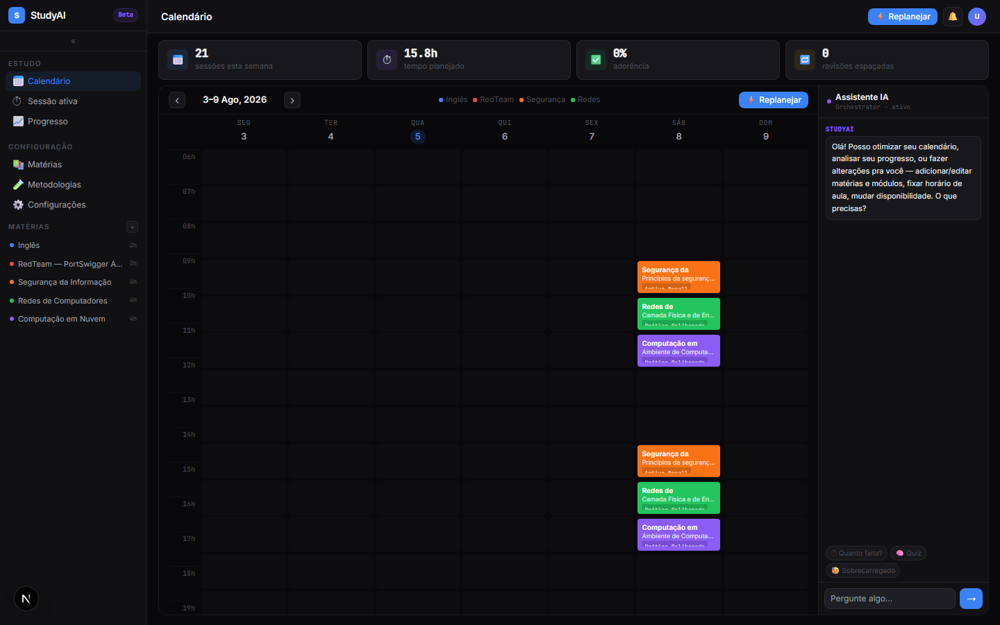
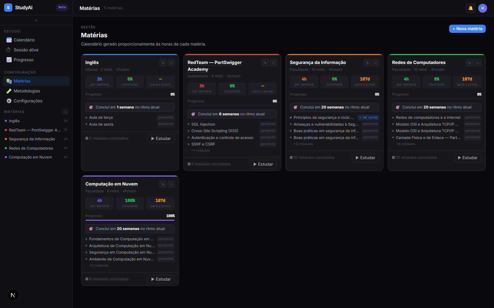
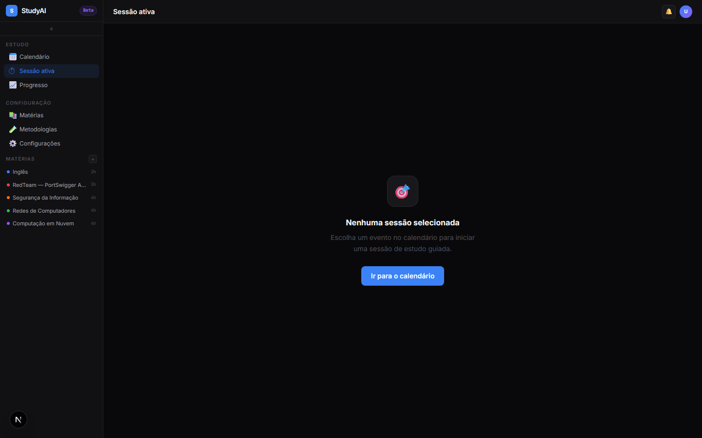
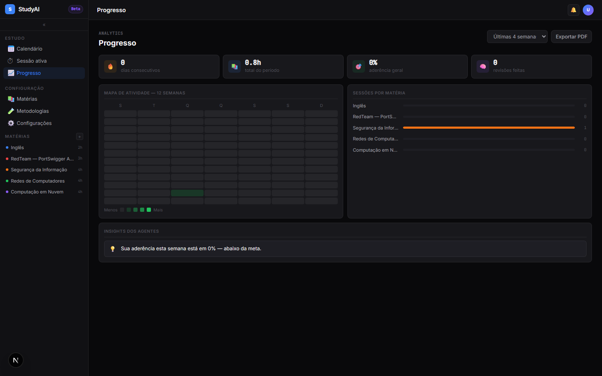
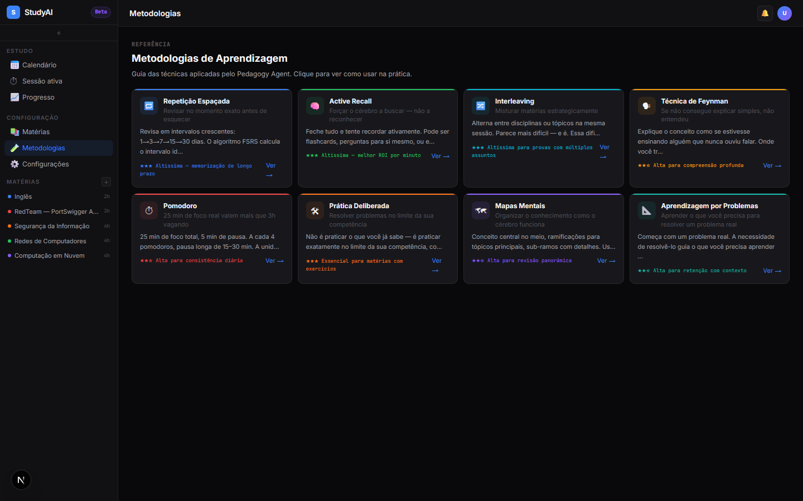
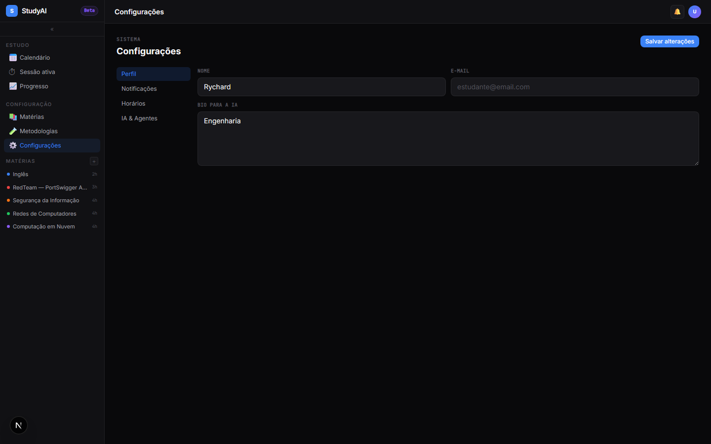

# StudyAI

**Calendário de estudos inteligente** — cadastre suas matérias e disponibilidade, e um time de
agentes de IA (Claude) monta seu cronograma semanal aplicando ciência do aprendizado (repetição
espaçada, interleaving, active recall). App local, single-user, sem login.




## Índice

- [O que é](#o-que-é)
- [Funcionalidades](#funcionalidades)
- [Stack](#stack)
- [Começando](#começando)
- [Guia de uso](#guia-de-uso)
- [Estrutura do projeto](#estrutura-do-projeto)
- [Scripts](#scripts)
- [Status do projeto](#status-do-projeto)

## O que é

StudyAI é um app web **local-first**: roda na sua máquina, guarda os dados num SQLite local
(`apps/web/data/studyai.db`, criado automaticamente) e não tem tela de login — é feito para um
usuário só. O núcleo do produto é um conjunto de **agentes de IA** que, a partir das suas
matérias, conteúdo e horários livres, geram e ajustam automaticamente seu calendário de estudos,
aplicando de forma prática:

- **Repetição espaçada (FSRS)** — revisar cada tópico pouco antes de esquecê-lo.
- **Interleaving** — alternar entre matérias na mesma sessão em vez de maratonar uma só.
- **Active recall** — testar a memória ativamente, não só reler o conteúdo.

Todos os agentes vivem em `apps/web/src/lib/agents/`. Só o **Curriculum Agent** e o
**Orchestrator** chamam a API da Anthropic (Claude); Pedagogy, Scheduler, Progress, Notification e
QA são lógica determinística local, sem custo de API a cada uso. Detalhes completos da arquitetura
e do fluxo de geração de calendário: [docs/ARCHITECTURE.md](docs/ARCHITECTURE.md).

## Funcionalidades

### 📅 Calendário / Dashboard
Grade semanal com as sessões já distribuídas pelos agentes. Clique num evento para ver detalhes,
ou em **⚡ Replanejar** para os agentes recalcularem o cronograma. Cartões de estatística no topo
(sessões da semana, horas planejadas, % de aderência, revisões pendentes) e um assistente de IA
lateral para conversar sobre o próprio plano.


### 📚 Matérias
Cadastro e gestão das disciplinas: nome (editável clicando em cima), horas semanais, progresso,
dias até a prova — com destaque visual quando a prova está próxima — e a lista de módulos de cada
uma, com status e estimativa de conclusão calculada pelo FSRS.



### ⏱️ Sessão de estudo
Execução guiada de uma sessão: timer com modo foco (tela cheia), checklist de tarefas e exercício
de active recall (pergunta → você responde → "Verificar"). Acessada a partir de um evento no
calendário ou do card de uma matéria.



### 📈 Progresso
Streak de dias consecutivos, horas estudadas, % de aderência ao plano, mapa de atividade (estilo
GitHub, 12 semanas), sessões por matéria e insights gerados automaticamente pelo Progress Agent
sobre seus padrões de estudo.



### 🎓 Metodologias
Vitrine de referência com 8 técnicas de estudo baseadas em evidência — Repetição Espaçada, Active
Recall, Interleaving, Técnica de Feynman, Pomodoro, Prática Deliberada, Mapas Mentais e
Aprendizagem por Problemas — cada uma com eficácia, quando usar, passo a passo e a base científica.



### ⚙️ Configurações
Perfil (nome/bio usados como contexto pela IA), notificações, horários de disponibilidade
(a mesma grade do onboarding, editável a qualquer momento) e a aba IA & Agentes.



### 🚀 Onboarding
Fluxo de 4 passos no primeiro uso: perfil → matérias → conteúdo/módulos → disponibilidade. Ao
final, já dispara a primeira geração de calendário e leva direto pro dashboard.

## Stack

| Camada | Tecnologia |
|---|---|
| Frontend | Next.js 15 (App Router) + React 18 + Tailwind CSS + framer-motion |
| Estado | Zustand + hooks customizados (`useCalendar`, `useAI`, `useTimer`, `useDisciplines`) |
| Backend | API Routes do próprio Next.js |
| IA | Claude (Anthropic SDK + `ai` SDK), validação de entrada com `zod` |
| Banco | SQLite local (`better-sqlite3`), zero configuração |
| Testes/CI | Vitest, GitHub Actions (lint, type-check, build, test, CodeQL) |

## Começando

Pré-requisitos: **Node.js 20+**, **pnpm 9+** e uma chave de API da Anthropic
([console.anthropic.com](https://console.anthropic.com)).

```bash
git clone https://github.com/rychardchagas/StudyAi.git
cd StudyAi
pnpm install

cp .env.example apps/web/.env.local
# edite apps/web/.env.local e cole sua ANTHROPIC_API_KEY

pnpm dev
# → http://localhost:3000
```

O banco SQLite é criado automaticamente na primeira execução, dentro de `apps/web/data/` — não
precisa configurar nada além da chave de API. Passo a passo completo:
[docs/GETTING_STARTED.md](docs/GETTING_STARTED.md).

## Guia de uso

1. **Primeiro acesso** → você cai no onboarding (`/onboarding`). Preencha seu perfil, cadastre
   pelo menos uma matéria com horas semanais e (opcional) data de prova, liste os módulos/conteúdo
   dela e marque seus horários livres na semana. Ao concluir, o app já gera seu primeiro
   calendário e te leva para o Dashboard.
2. **Todo dia** → abra o **Calendário**, veja as sessões agendadas para hoje e clique numa delas
   para abrir os detalhes; use **▶ Iniciar sessão** para ir para a tela de **Sessão ativa**.
3. **Durante a sessão** → siga o checklist, use o modo foco (tecla `F`) se quiser tela cheia sem
   distração, responda o exercício de active recall e conclua a sessão ao final — isso alimenta o
   histórico usado pelo Progress Agent e pelo FSRS para agendar a próxima revisão.
4. **Quando o plano mudar** (nova prova marcada, matéria adicionada, horários mudaram) → vá em
   **Matérias** para editar/adicionar, ou em **Configurações → Horários** para atualizar sua
   disponibilidade, depois clique em **⚡ Replanejar** no topo do Dashboard para os agentes
   recalcularem o calendário inteiro.
5. **De vez em quando** → confira **Progresso** para ver aderência, streak e os insights que os
   agentes geraram a partir do seu histórico real de sessões; use a página **Metodologias** se
   quiser entender *por que* o app está aplicando uma técnica específica num módulo.
6. **Assistente de IA** → o painel lateral do Dashboard permite perguntar diretamente ao
   Orchestrator coisas como "quanto falta pra prova de X" ou pedir um resumo/quiz rápido — os
   atalhos prontos ("Quanto falta?", "Quiz", "Sobrecarregado") já mandam esses pedidos comuns.

## Estrutura do projeto

```
studyai/
├── apps/
│   ├── web/                  ← app Next.js (produto real)
│   │   └── src/
│   │       ├── app/          ← rotas (App Router) + API routes
│   │       ├── components/   ← componentes React (ui/, shared/, por tela)
│   │       └── lib/
│   │           ├── agents/   ← Curriculum, Pedagogy, Scheduler, Progress, Notification, QA, Orchestrator
│   │           ├── db/       ← cliente SQLite + schema
│   │           ├── hooks/    ← useCalendar, useAI, useTimer, useDisciplines...
│   │           └── utils/    ← FSRS, helpers
│   └── mobile/                ← futuro app React Native
├── packages/                  ← ui/ e types/ compartilhados (ainda vazios)
└── docs/                      ← ARCHITECTURE.md, GETTING_STARTED.md, ROADMAP.md
```

## Scripts

Rodados na raiz do monorepo via Turborepo:

```bash
pnpm dev          # inicia o app em desenvolvimento
pnpm build        # build de produção
pnpm lint         # ESLint
pnpm type-check   # checagem de tipos (tsc --noEmit)
```

Dentro de `apps/web`, também há `pnpm test` (Vitest).

## Status do projeto

Todas as 7 fases de migração do protótipo original (`apps/web/src/app/prototype/StudyAI.jsx`,
mantido no repo como referência de design) para os componentes reais em produção estão
concluídas. CI ativo (lint, type-check, build, testes, CodeQL) e Dependabot habilitado. Roadmap
detalhado e próximos passos: [docs/ROADMAP.md](docs/ROADMAP.md).

Fora do escopo por enquanto: tela de flashcards dedicada, app mobile e animações de celebração
mais elaboradas.
